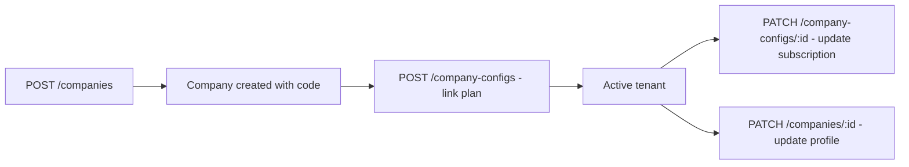
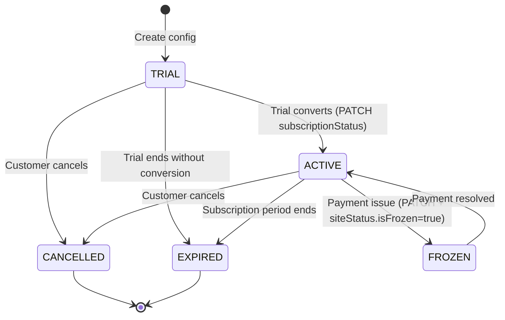

# Admin Portal API — Companies, Company Configs & Audit

> **Family:** `admin-portal-api.md`
> **Base URL:** `http://localhost:3000/api/v1`
> **Auth:** All routes require `Authorization: Bearer <accessToken>`
>
> ⚠️ **SaaS Admin Context** — These endpoints manage platform-level data. They have no per-company permission middleware — access must be restricted at the network/gateway level to SaaS admin accounts only.
>
> See also: [admin-portal-leads.md](./admin-portal-leads.md) · [admin-portal-plans.md](./admin-portal-plans.md)

---

## Companies

### Overview

Companies are the root multi-tenant entity. Each company gets a unique `companyCode` (auto-generated from name if not provided). The code is **immutable** after creation.



---

### `POST /companies`

Create a new company (tenant). A `companyCode` is auto-generated from the name if not provided.

**Request Body**
```json
{
  "name": "Edara Solutions",
  "phoneNumber": "+966112345678",
  "country": "SA",
  "website": "https://edara.com",
  "logo": null,
  "isActive": true,
  "addressLine": "King Fahd Road, Riyadh",
  "companyCode": "EDARA"
}
```

| Field | Type | Required | Validation |
|-------|------|----------|-----------|
| `name` | string | ✅ | 3–255 chars |
| `phoneNumber` | string | ✅ | 10–15 chars |
| `country` | string | ✅ | 2–100 chars |
| `website` | string \| null | ❌ | |
| `logo` | string \| null | ❌ | URL |
| `isActive` | boolean | ❌ | Default `true` |
| `addressLine` | string \| null | ❌ | |
| `companyCode` | string | ❌ | 2–10 chars, `^[A-Z0-9]+$`. Auto-generated if omitted |

**Response `201 Created`**
```json
{
  "publicId": "7f3b4c8d-1234-4321-abcd-ef1234567890",
  "logo": null,
  "name": "Edara Solutions",
  "website": "https://edara.com",
  "phoneNumber": "+966112345678",
  "country": "SA",
  "companyCode": "EDARA",
  "isActive": true,
  "addressLine": "King Fahd Road, Riyadh",
  "createdAt": "2026-05-16T10:00:00.000Z",
  "updatedAt": "2026-05-16T10:00:00.000Z",
  "deletedAt": null
}
```

**Error Responses**
| Status | Condition |
|--------|-----------|
| `409` | `companyCode` or name already exists |
| `422` | Invalid code format (must be `[A-Z0-9]+`) |

---

### `GET /companies`

List companies with page-based pagination.

**Query Parameters**
| Param | Type | Default | Notes |
|-------|------|---------|-------|
| `page` | integer | 1 | |
| `limit` | integer | 10 | max 100 |

**Response `200 OK`**
```json
{
  "data": [
    {
      "publicId": "7f3b4c8d-1234-4321-abcd-ef1234567890",
      "logo": null,
      "name": "Edara Solutions",
      "website": "https://edara.com",
      "phoneNumber": "+966112345678",
      "country": "SA",
      "companyCode": "EDARA",
      "isActive": true,
      "addressLine": "King Fahd Road, Riyadh",
      "createdAt": "2026-05-16T10:00:00.000Z",
      "updatedAt": "2026-05-16T10:00:00.000Z",
      "deletedAt": null
    }
  ],
  "meta": {
    "page": 1,
    "limit": 10,
    "total": 47,
    "totalPages": 5
  }
}
```

---

### `GET /companies/cursor`

List companies with cursor-based pagination (for infinite scroll / large datasets).

**Query Parameters**
| Param | Type | Default | Notes |
|-------|------|---------|-------|
| `cursor` | string | — | Opaque cursor from previous response |
| `limit` | integer | 20 | max 100 |

**Response `200 OK`**
```json
{
  "data": [ ...companies ],
  "meta": {
    "nextCursor": "MjAyNi0wNS0xNlQxMDowMDowMFo6NDI=",
    "limit": 20,
    "hasMore": true
  }
}
```

---

### `GET /companies/:publicId`

Get a single company by UUID.

**Response `200 OK`** — single company object (same shape as list item)

**Error Responses**
| Status | Condition |
|--------|-----------|
| `404` | Company not found |

---

### `PATCH /companies/:publicId`

Update company profile. `companyCode` is immutable — omit it from updates.

**Request Body** (all fields optional)
```json
{
  "name": "Edara Solutions Ltd.",
  "phoneNumber": "+966112345679",
  "website": "https://edara.io",
  "isActive": false,
  "addressLine": "Prince Sultan Road, Jeddah",
  "logo": "https://cdn.edara.com/logo.png",
  "country": "SA"
}
```

**Response `200 OK`**
```json
{ "message": "Company updated successfully" }
```

---

### `DELETE /companies/:publicId`

Soft-delete a company.

**Response `200 OK`**
```json
{ "message": "Company deleted successfully" }
```

---

## Company Configs (Subscription Management)

Each company has one `CompanyConfig` that links it to a plan and tracks subscription state. The config is created after the company is created.

### `POST /company-configs`

Create a company config (link a company to a plan and set initial subscription state).

**Request Body**
```json
{
  "companyId": 7,
  "planId": 3,
  "subscriptionStatus": "TRIAL",
  "siteStatus": {
    "isFrozen": false,
    "isReadOnly": false,
    "isBlocked": false,
    "isUnderMaintenance": false
  },
  "subscriptionStartDate": "2026-05-16T00:00:00.000Z",
  "subscriptionEndDate": null,
  "trialEndDate": "2026-06-15T23:59:59.000Z",
  "subscriptionNotes": "30-day free trial"
}
```

| Field | Type | Required | Notes |
|-------|------|----------|-------|
| `companyId` | integer | ✅ | Internal DB id of the company |
| `planId` | integer | ✅ | Internal DB id of the plan |
| `subscriptionStatus` | `SubscriptionStatus` | ✅ | See enum catalog |
| `siteStatus` | object | ✅ | All 4 boolean flags required |
| `siteStatus.isFrozen` | boolean | ✅ | Freezes company access |
| `siteStatus.isReadOnly` | boolean | ✅ | Read-only mode |
| `siteStatus.isBlocked` | boolean | ✅ | Fully blocks access |
| `siteStatus.isUnderMaintenance` | boolean | ✅ | Maintenance banner |
| `siteStatus.note` | string \| null | ❌ | Optional admin note |
| `subscriptionStartDate` | ISO datetime \| null | ❌ | |
| `subscriptionEndDate` | ISO datetime \| null | ❌ | |
| `trialEndDate` | ISO datetime \| null | ❌ | |
| `subscriptionNotes` | string \| null | ❌ | Internal notes |

**Response `201 Created`**
```json
{
  "public_id": "cfg-uuid-1234",
  "companyId": 7,
  "planId": 3,
  "subscriptionStatus": "TRIAL",
  "siteStatus": {
    "isFrozen": false,
    "isReadOnly": false,
    "isBlocked": false,
    "isUnderMaintenance": false,
    "note": null
  },
  "subscriptionStartDate": "2026-05-16T00:00:00.000Z",
  "subscriptionEndDate": null,
  "trialEndDate": "2026-06-15T23:59:59.000Z",
  "subscriptionNotes": "30-day free trial",
  "createdAt": "2026-05-16T10:00:00.000Z",
  "updatedAt": "2026-05-16T10:00:00.000Z",
  "deletedAt": null
}
```

> ⚠️ Note the field name is `public_id` (snake_case) — this is a known inconsistency vs other modules which use `publicId`.

---

### `GET /company-configs`

List all company configs with relations (company + plan embedded).

**Response `200 OK`**
```json
{
  "data": [
    {
      "public_id": "cfg-uuid-1234",
      "companyId": 7,
      "planId": 3,
      "subscriptionStatus": "TRIAL",
      "siteStatus": {
        "isFrozen": false,
        "isReadOnly": false,
        "isBlocked": false,
        "isUnderMaintenance": false,
        "note": null
      },
      "subscriptionStartDate": "2026-05-16T00:00:00.000Z",
      "subscriptionEndDate": null,
      "trialEndDate": "2026-06-15T23:59:59.000Z",
      "subscriptionNotes": "30-day free trial",
      "createdAt": "2026-05-16T10:00:00.000Z",
      "updatedAt": "2026-05-16T10:00:00.000Z",
      "deletedAt": null,
      "company": {
        "publicId": "7f3b4c8d-1234-4321-abcd-ef1234567890",
        "name": "Edara Solutions",
        "companyCode": "EDARA",
        "country": "SA",
        "isActive": true,
        "phoneNumber": "+966112345678"
      },
      "plan": {
        "publicId": "plan-uuid-1234",
        "name": "Professional",
        "duration": 12,
        "features": ["ATTENDANCE", "ANALYTICS", "TEAM_MANAGEMENT"],
        "limits": { "MAX_USERS": 200, "MAX_DEPARTMENTS": 20 },
        "isPublic": true,
        "isActive": true
      }
    }
  ]
}
```

---

### `GET /company-configs/:publicId`

Get a single config with full company + plan relations.

**URL Params:** use the `public_id` value (UUID)

**Response `200 OK`** — single config object with relations (same shape as list item)

---

### `PATCH /company-configs/:publicId`

Update subscription status, plan assignment, or site status flags.

**Request Body** (all fields optional)
```json
{
  "planId": 4,
  "subscriptionStatus": "ACTIVE",
  "subscriptionStartDate": "2026-06-01T00:00:00.000Z",
  "subscriptionEndDate": "2027-06-01T00:00:00.000Z",
  "trialEndDate": null,
  "subscriptionNotes": "Upgraded to annual plan",
  "siteStatus": {
    "isFrozen": false,
    "isReadOnly": false,
    "isBlocked": false,
    "isUnderMaintenance": false,
    "note": null
  }
}
```

**Response `200 OK`**
```json
{ "message": "Company config updated successfully" }
```

---

### `DELETE /company-configs/:publicId`

Delete a company config.

**Response `200 OK`**
```json
{ "message": "Company config deleted successfully" }
```

---

## Subscription Lifecycle



### Site Status Flags — Quick Reference

| Flag | Effect on tenant |
|------|----------------|
| `isFrozen` | Account frozen — users cannot login |
| `isReadOnly` | Data visible but no writes allowed |
| `isBlocked` | Hard block — typically for payment/abuse |
| `isUnderMaintenance` | Show maintenance page to users |

> Flags are **additive** — you can combine them (e.g. `isFrozen + isUnderMaintenance`).

---

## Audit Log

> **Access:** Requires `audit:read` permission. Scoped to the **authenticated user's company** — SaaS admins must have a company context.

### `GET /audit`

Fetch the audit log for the current company with optional filters.

**Required Permission:** `audit:read`

**Query Parameters**
| Param | Type | Notes |
|-------|------|-------|
| `action` | string | Filter by action (e.g. `auth:login`, `users:create`) |
| `outcome` | `"success"` \| `"failure"` | Filter by outcome |
| `targetPublicId` | UUID string | Filter events targeting a specific resource |
| `page` | integer | Default 1 |
| `pageSize` | integer | Default 25, max 100 |

**Response `200 OK`**
```json
{
  "items": [
    {
      "action": "auth:login",
      "module": "auth",
      "targetType": null,
      "targetPublicId": null,
      "outcome": "success",
      "metadata": {
        "clientType": "web",
        "ipAddress": "185.100.10.25",
        "country": "SA"
      },
      "createdAt": "2026-05-16T09:30:00.000Z"
    },
    {
      "action": "users:create",
      "module": "users",
      "targetType": "user",
      "targetPublicId": "550e8400-e29b-41d4-a716-446655440000",
      "outcome": "success",
      "metadata": {
        "createdByUserId": 1
      },
      "createdAt": "2026-05-16T10:00:00.000Z"
    },
    {
      "action": "auth:login",
      "module": "auth",
      "targetType": null,
      "targetPublicId": null,
      "outcome": "failure",
      "metadata": {
        "reason": "WRONG_PASSWORD",
        "ipAddress": "203.0.113.50"
      },
      "createdAt": "2026-05-15T14:22:00.000Z"
    }
  ],
  "meta": {
    "mode": "page",
    "page": 1,
    "pageSize": 25,
    "totalItems": 1240,
    "totalPages": 50
  }
}
```

### Common Audit Actions

| Action | Module | When triggered |
|--------|--------|---------------|
| `auth:login` | auth | Login attempt (success or failure) |
| `auth:logout` | auth | User logged out |
| `auth:refresh` | auth | Token refreshed |
| `auth:password-changed` | auth | Password changed |
| `auth:invitation-accepted` | auth | Invitation used |
| `auth:force-reset` | auth | Admin forced reset |
| `users:create` | users | Employee created |
| `users:update` | users | Employee updated |
| `users:delete` | users | Employee deleted |
| `roles:create` | rbac | Role created |
| `roles:assign` | rbac | Role assigned to user |
| `sessions:revoke` | auth | Session revoked by admin |

> The `metadata` object is free-form JSON — contents vary per action. Never rely on its structure for business logic.

### UI Tips for Audit Log

1. **Filter by user** — use `targetPublicId` with a specific user's UUID to audit all actions on that user.
2. **Security monitoring** — filter `action=auth:login&outcome=failure` to detect brute-force attempts.
3. **Color-code outcomes** — green for `success`, red for `failure`.
4. **Infinite scroll** — this table can grow very large; use pagination with a small `pageSize` (25).
