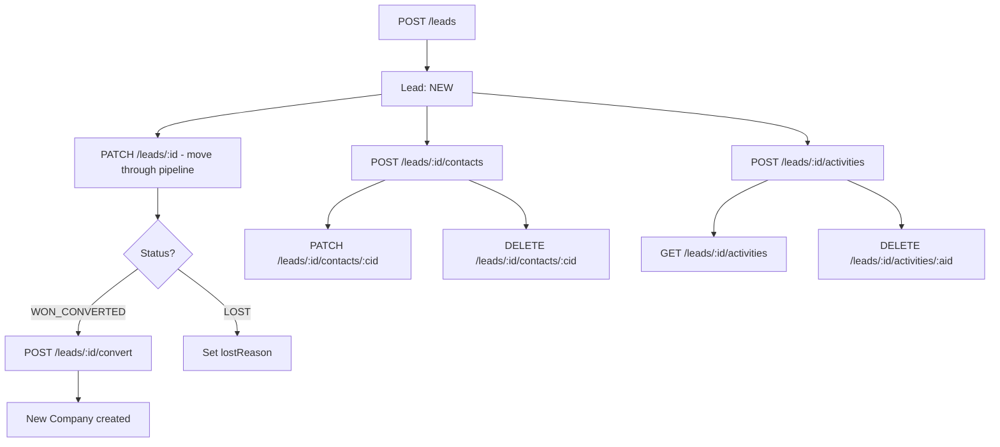
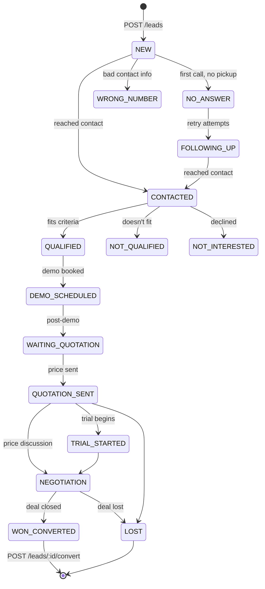

# Admin Portal API — Leads Pipeline

> **Family:** `admin-portal-api.md`
> **Base URL:** `http://localhost:3000/api/v1`
> **Auth:** All routes require `Authorization: Bearer <accessToken>`
>
> ⚠️ **SaaS Admin Context** — No per-company tenant scoping. Leads are platform-level CRM data.
>
> See also: [admin-portal-api.md](./admin-portal-api.md) · [admin-portal-plans.md](./admin-portal-plans.md)

---

## Overview

Leads represent prospective customers moving through the sales pipeline. Each lead can have multiple contacts and an activity log. When a lead converts, it becomes a Company (tenant).



---

## Leads CRUD

### `POST /leads`

Create a new lead. Optionally include a primary contact in the same request.

**Request Body**
```json
{
  "companyName": "TechCorp Arabia",
  "website": "https://techcorp.sa",
  "industry": "Technology",
  "companySizeRange": "21_TO_50",
  "country": "SA",
  "city": "Riyadh",
  "source": "LINKEDIN",
  "status": "NEW",
  "lostReason": null,
  "ownerUserId": null,
  "primaryContact": {
    "name": "Mohammed Al-Faisal",
    "email": "m.faisal@techcorp.sa",
    "phone": "+966501234567",
    "jobTitle": "CEO",
    "isPrimary": true
  }
}
```

| Field | Type | Required | Notes |
|-------|------|----------|-------|
| `companySizeRange` | `CompanySizeRange` | ✅ | See enum catalog |
| `source` | `LeadSource` | ✅ | See enum catalog |
| `status` | `LeadStatus` | ✅ | Cannot be `REJOINED` |
| `companyName` | string | ❌ | |
| `website` | string | ❌ | |
| `industry` | string | ❌ | |
| `country` | string | ❌ | |
| `city` | string | ❌ | |
| `lostReason` | `LostReason` \| null | ❌ | Required if status is `LOST` |
| `ownerUserId` | integer \| null | ❌ | Internal user id of assigned salesperson |
| `primaryContact` | object | ❌ | Creates a contact simultaneously |

**Response `201 Created`**
```json
{
  "lead": {
    "id": 14,
    "publicId": "3fa85f64-5717-4562-b3fc-2c963f66afa6",
    "companyName": "TechCorp Arabia",
    "website": "https://techcorp.sa",
    "industry": "Technology",
    "companySizeRange": "21_TO_50",
    "country": "SA",
    "city": "Riyadh",
    "source": "LINKEDIN",
    "status": "NEW",
    "lostReason": null,
    "ownerUserId": null,
    "numberOfAttempts": 0,
    "companyId": null,
    "createdAt": "2026-05-16T10:00:00.000Z",
    "updatedAt": "2026-05-16T10:00:00.000Z",
    "deletedAt": null
  },
  "contacts": [
    {
      "id": 5,
      "publicId": "contact-uuid-1",
      "leadId": 14,
      "name": "Mohammed Al-Faisal",
      "email": "m.faisal@techcorp.sa",
      "phone": "+966501234567",
      "jobTitle": "CEO",
      "isPrimary": true,
      "createdAt": "2026-05-16T10:00:00.000Z",
      "updatedAt": "2026-05-16T10:00:00.000Z",
      "deletedAt": null
    }
  ]
}
```

> The response shape is `LeadWithContacts` — a `lead` object plus its `contacts[]` array.

---

### `GET /leads`

List leads with filters and pagination.

**Query Parameters**
| Param | Type | Notes |
|-------|------|-------|
| `status` | `LeadStatus` | Filter by status |
| `source` | `LeadSource` | Filter by source |
| `ownerUserId` | integer | Filter by assigned salesperson |
| `country` | string | Filter by country |
| `createdFrom` | date string | ISO date — filter by creation start |
| `createdTo` | date string | ISO date — filter by creation end |
| `search` | string | Full-text search on company name, contact info |
| `page` | integer | Default 1 |
| `pageSize` | integer | Default 25, max 100 |
| `sort` | string | `createdAtAsc` \| `createdAtDesc` |

**Response `200 OK`**
```json
{
  "items": [
    {
      "lead": {
        "publicId": "3fa85f64-5717-4562-b3fc-2c963f66afa6",
        "companyName": "TechCorp Arabia",
        "website": "https://techcorp.sa",
        "industry": "Technology",
        "companySizeRange": "21_TO_50",
        "country": "SA",
        "city": "Riyadh",
        "source": "LINKEDIN",
        "status": "QUALIFIED",
        "lostReason": null,
        "ownerUserId": 3,
        "numberOfAttempts": 4,
        "companyId": null,
        "createdAt": "2026-05-10T10:00:00.000Z",
        "updatedAt": "2026-05-16T09:00:00.000Z",
        "deletedAt": null
      },
      "contacts": [
        {
          "publicId": "contact-uuid-1",
          "name": "Mohammed Al-Faisal",
          "email": "m.faisal@techcorp.sa",
          "phone": "+966501234567",
          "jobTitle": "CEO",
          "isPrimary": true
        }
      ]
    }
  ],
  "meta": {
    "mode": "page",
    "page": 1,
    "pageSize": 25,
    "totalItems": 83,
    "totalPages": 4
  }
}
```

---

### `GET /leads/:publicId`

Get a single lead with contacts.

**URL Params:** `publicId` — UUID

**Response `200 OK`** — single `LeadWithContacts` (same shape as list item)

**Error Responses**
| Status | Condition |
|--------|-----------|
| `404` | Lead not found |

---

### `PATCH /leads/:publicId`

Update lead fields. All fields are optional.

**URL Params:** `publicId` — UUID

**Request Body**
```json
{
  "status": "DEMO_SCHEDULED",
  "ownerUserId": 5,
  "industry": "Fintech",
  "lostReason": null,
  "allowStatusOverride": false
}
```

| Field | Type | Notes |
|-------|------|-------|
| `status` | `LeadStatus` | Cannot set `REJOINED` directly |
| `lostReason` | `LostReason` \| null | Must set when status is `LOST` |
| `allowStatusOverride` | boolean | Bypass status transition validation if `true` |
| `ownerUserId` | integer \| null | |
| `companyName` \| `website` \| `industry` \| `country` \| `city` | string \| null | |
| `companySizeRange` | `CompanySizeRange` | |
| `source` | `LeadSource` | |

**Response `200 OK`** — updated `LeadWithContacts`

**Error Responses**
| Status | Condition |
|--------|-----------|
| `422` | Invalid status transition (use `allowStatusOverride: true` to force) |
| `404` | Lead not found |

---

### `DELETE /leads/:publicId`

Soft-delete a lead.

**Response `204 No Content`**

---

## Contacts

Each lead can have multiple contacts. At most one can be `isPrimary: true`.

### `POST /leads/:publicId/contacts`

Add a contact to a lead.

**URL Params:** `publicId` — lead UUID

**Request Body**
```json
{
  "name": "Fatima Al-Zahrani",
  "email": "f.zahrani@techcorp.sa",
  "phone": "+966509876543",
  "jobTitle": "COO",
  "isPrimary": false
}
```

| Field | Type | Required | Notes |
|-------|------|----------|-------|
| `name` | string | ❌ | |
| `email` | string (email) | ❌ | |
| `phone` | string | ❌ | |
| `jobTitle` | string | ❌ | |
| `isPrimary` | boolean | ❌ | Promoting this contact demotes the previous primary |

**Response `201 Created`** — created contact object
```json
{
  "publicId": "contact-uuid-2",
  "leadId": 14,
  "name": "Fatima Al-Zahrani",
  "email": "f.zahrani@techcorp.sa",
  "phone": "+966509876543",
  "jobTitle": "COO",
  "isPrimary": false,
  "createdAt": "2026-05-16T10:30:00.000Z",
  "updatedAt": "2026-05-16T10:30:00.000Z",
  "deletedAt": null
}
```

---

### `PATCH /leads/:publicId/contacts/:contactPublicId`

Update a contact. All fields optional.

**URL Params:**
- `publicId` — lead UUID
- `contactPublicId` — contact UUID

**Request Body**
```json
{
  "name": "Fatima Al-Zahrani",
  "jobTitle": "CEO",
  "isPrimary": true
}
```

> Setting `isPrimary: true` on this contact automatically demotes the previous primary contact.

**Response `200 OK`** — updated contact object

---

### `DELETE /leads/:publicId/contacts/:contactPublicId`

Remove a contact from the lead.

**Response `204 No Content`**

**Error Responses**
| Status | Condition |
|--------|-----------|
| `422` | Cannot delete the only primary contact |

---

## Activities

Activities form a chronological log of all interactions with a lead.

### `POST /leads/:publicId/activities`

Log a new activity (call, email, meeting, etc).

**URL Params:** `publicId` — lead UUID

**Request Body**
```json
{
  "type": "CALLING_ON_WHATSAPP",
  "note": "Spoke with Mohammed for 15 min. He's interested in the Professional plan. Scheduled a demo for next Tuesday."
}
```

| Field | Type | Required | Validation |
|-------|------|----------|-----------|
| `type` | `LeadActivityType` | ✅ | See enum catalog |
| `note` | string | ✅ | max 1000 chars |

**Response `201 Created`**
```json
{
  "publicId": "activity-uuid-1",
  "leadId": 14,
  "type": "CALLING_ON_WHATSAPP",
  "note": "Spoke with Mohammed for 15 min. He's interested in the Professional plan. Scheduled a demo for next Tuesday.",
  "createdAt": "2026-05-16T11:00:00.000Z",
  "updatedAt": "2026-05-16T11:00:00.000Z",
  "deletedAt": null
}
```

---

### `GET /leads/:publicId/activities`

List all activities for a lead (paginated, newest first).

**URL Params:** `publicId` — lead UUID

**Query Parameters**
| Param | Type | Default | Notes |
|-------|------|---------|-------|
| `page` | integer | 1 | |
| `pageSize` | integer | 25 | max 100 |

**Response `200 OK`**
```json
{
  "items": [
    {
      "publicId": "activity-uuid-2",
      "leadId": 14,
      "type": "MEETING",
      "note": "Demo call completed. Client wants proposal by Friday.",
      "createdAt": "2026-05-16T14:00:00.000Z",
      "updatedAt": "2026-05-16T14:00:00.000Z",
      "deletedAt": null
    },
    {
      "publicId": "activity-uuid-1",
      "leadId": 14,
      "type": "CALLING_ON_WHATSAPP",
      "note": "Initial contact call.",
      "createdAt": "2026-05-16T11:00:00.000Z",
      "updatedAt": "2026-05-16T11:00:00.000Z",
      "deletedAt": null
    }
  ],
  "meta": {
    "mode": "page",
    "page": 1,
    "pageSize": 25,
    "totalItems": 12,
    "totalPages": 1
  }
}
```

---

### `DELETE /leads/:publicId/activities/:activityPublicId`

Delete an activity entry.

**URL Params:**
- `publicId` — lead UUID
- `activityPublicId` — activity UUID

**Response `204 No Content`**

---

## Lead Conversion

### `POST /leads/:publicId/convert`

Convert a won lead into a Company (tenant). This is the critical handoff from CRM to the HRMS platform.

**URL Params:** `publicId` — lead UUID (must be in `WON_CONVERTED` status or use `allowStatusOverride`)

**Request Body**
```json
{
  "phoneNumber": "+966112345678",
  "name": "TechCorp Arabia LLC",
  "country": "SA",
  "website": "https://techcorp.sa",
  "logo": null,
  "addressLine": "King Abdullah Road, Riyadh"
}
```

| Field | Type | Required | Notes |
|-------|------|----------|-------|
| `phoneNumber` | string | ✅ | 1–15 chars |
| `name` | string | ❌ | Defaults to lead's `companyName` |
| `country` | string | ❌ | Defaults to lead's `country` |
| `website` | string | ❌ | |
| `logo` | string | ❌ | URL |
| `addressLine` | string | ❌ | |

**Response `201 Created`** — newly created Company object
```json
{
  "publicId": "7f3b4c8d-9999-4321-abcd-ef1234567890",
  "logo": null,
  "name": "TechCorp Arabia LLC",
  "website": "https://techcorp.sa",
  "phoneNumber": "+966112345678",
  "country": "SA",
  "companyCode": "TECHC",
  "isActive": true,
  "addressLine": "King Abdullah Road, Riyadh",
  "createdAt": "2026-05-16T12:00:00.000Z",
  "updatedAt": "2026-05-16T12:00:00.000Z",
  "deletedAt": null
}
```

> After conversion, the lead's `companyId` field is set to the new company's internal id, and status becomes `WON_CONVERTED`. Next step: `POST /company-configs` to assign a plan.

**Error Responses**
| Status | Condition |
|--------|-----------|
| `422` | Lead status is not `WON_CONVERTED` |
| `409` | Company name or phone already exists |
| `404` | Lead not found |

---

## Lead Pipeline — Status Transitions



> Use `allowStatusOverride: true` in the PATCH body to bypass transition validation when needed (e.g. admin correction).

---

## UI Implementation Notes

1. **Kanban board** — `GET /leads?page=1&pageSize=100` scoped by status per column; use `status` filter per column.
2. **Activity timeline** — display activities in reverse chronological order (newest first, as returned by API).
3. **Contact primary badge** — always show `isPrimary` visually; ensure only one primary contact per lead in your UI.
4. **Conversion button** — enable only when `status === "WON_CONVERTED"`. After `POST /leads/:id/convert` succeeds, redirect to `POST /company-configs` to complete onboarding.
5. **`numberOfAttempts`** — auto-incremented by the backend on each activity log; use it to show "4 contact attempts" in the lead card.
6. **Lost reason** — `lostReason` field becomes mandatory (domain-level) when setting `status: "LOST"`.
