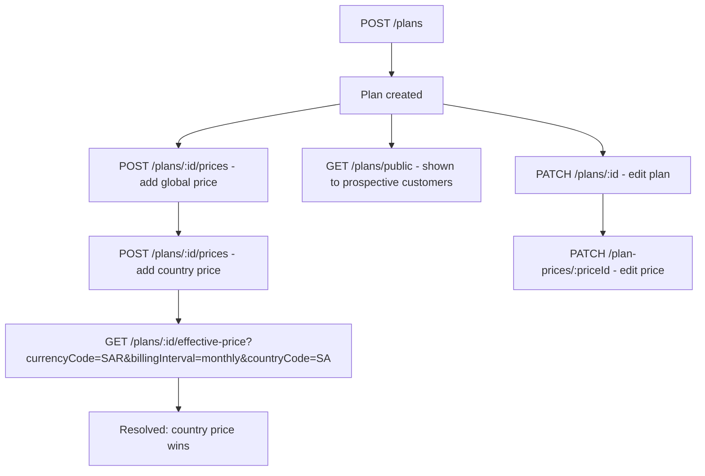
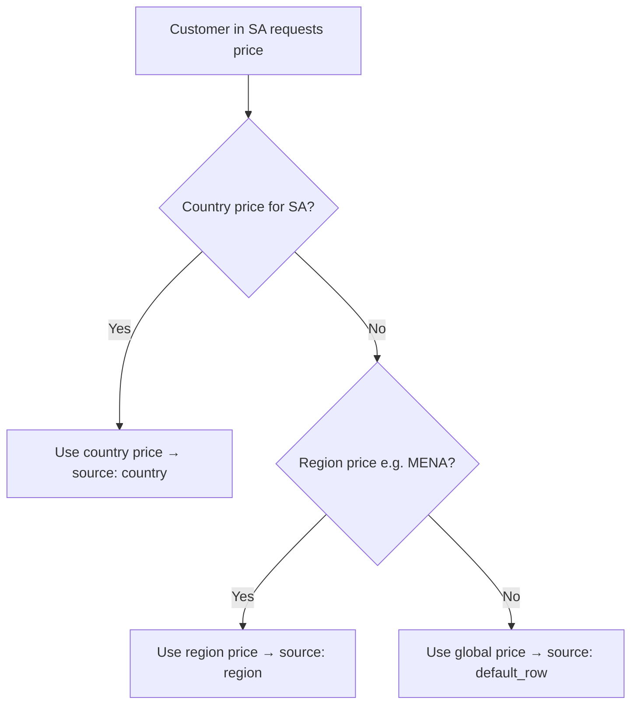

# Admin Portal API — Plans & Pricing

> **Family:** `admin-portal-api.md`
> **Base URL:** `http://localhost:3000/api/v1`
> **Auth:** All routes require `Authorization: Bearer <accessToken>`
>
> ⚠️ **SaaS Admin Context** — Plans are platform-level. No per-company scoping.
>
> See also: [admin-portal-api.md](./admin-portal-api.md) · [admin-portal-leads.md](./admin-portal-leads.md)

---

## Overview

Plans define what features and limits a company gets. Each plan can have multiple `PlanPrice` entries scoped to country, region, or global (default). The pricing resolution waterfall is: **country → region → global default**.



---

## Plans

### `POST /plans`

Create a new subscription plan.

**Request Body**
```json
{
  "name": "Professional",
  "description": "Full-featured HR management for growing teams",
  "duration": 12,
  "features": ["ATTENDANCE", "ANALYTICS", "OVERVIEW", "TEAM_MANAGEMENT"],
  "limits": {
    "MAX_USERS": 200,
    "MAX_DEPARTMENTS": 20,
    "MAX_POSITIONS": 50
  },
  "isPublic": true,
  "isActive": true
}
```

| Field | Type | Required | Validation |
|-------|------|----------|-----------|
| `name` | string | ✅ | 1–255 chars |
| `duration` | integer | ✅ | min 1 (in months typically) |
| `features` | string[] | ✅ | Items from `PLAN_FEATURES` enum |
| `description` | string \| null | ❌ | |
| `limits` | object | ❌ | Keys from `PLAN_LIMITS` enum; values are integers ≥ 0 |
| `isPublic` | boolean | ❌ | Show on public pricing page |
| `isActive` | boolean | ❌ | Available for assignment |

**Response `201 Created`**
```json
{
  "publicId": "plan-uuid-1234",
  "name": "Professional",
  "description": "Full-featured HR management for growing teams",
  "duration": 12,
  "features": ["ATTENDANCE", "ANALYTICS", "OVERVIEW", "TEAM_MANAGEMENT"],
  "limits": {
    "MAX_USERS": 200,
    "MAX_DEPARTMENTS": 20,
    "MAX_POSITIONS": 50
  },
  "isPublic": true,
  "isActive": true,
  "createdAt": "2026-05-16T10:00:00.000Z",
  "updatedAt": "2026-05-16T10:00:00.000Z",
  "deletedAt": null
}
```

**Error Responses**
| Status | Condition |
|--------|-----------|
| `409` | Plan name already exists |
| `422` | Invalid feature or limit key |

---

### `GET /plans`

List all plans (admin view — includes private and inactive).

**Query Parameters**
| Param | Type | Notes |
|-------|------|-------|
| `name` | string | Filter by name (partial match) |
| `isPublic` | boolean | Filter public/private plans |
| `isActive` | boolean | Filter active/inactive plans |
| `countryCode` | string | `^[A-Z]{2}$` — resolve effective price for this country |
| `regionCode` | string | max 32 chars |
| `currencyCode` | string | `^[A-Z]{3}$` |
| `billingInterval` | string | e.g. `monthly`, `yearly` |
| `intervalCount` | integer | default 1 |

> When `currencyCode` + `billingInterval` are provided, each plan in the response includes `effectivePrice`.

**Response `200 OK`**
```json
{
  "data": [
    {
      "publicId": "plan-uuid-1234",
      "name": "Professional",
      "description": "Full-featured HR management",
      "duration": 12,
      "features": ["ATTENDANCE", "ANALYTICS", "OVERVIEW", "TEAM_MANAGEMENT"],
      "limits": {
        "MAX_USERS": 200,
        "MAX_DEPARTMENTS": 20,
        "MAX_POSITIONS": 50
      },
      "isPublic": true,
      "isActive": true,
      "createdAt": "2026-05-16T10:00:00.000Z",
      "updatedAt": "2026-05-16T10:00:00.000Z",
      "deletedAt": null,
      "prices": [
        {
          "publicId": "price-uuid-1",
          "countryCode": null,
          "regionCode": null,
          "billingInterval": "monthly",
          "intervalCount": 1,
          "isActive": true,
          "money": {
            "currencyCode": "USD",
            "currencyExponent": 2,
            "amountMinor": 9900,
            "amountMajor": "99.00",
            "formattedAmount": "USD 99.00"
          },
          "createdAt": "2026-05-16T10:00:00.000Z",
          "updatedAt": "2026-05-16T10:00:00.000Z"
        }
      ],
      "effectivePrice": null
    }
  ]
}
```

---

### `GET /plans/public`

List only public, visible plans (for customer-facing pricing page). Does **not** return private or inactive plans.

**Query Parameters** — same as `GET /plans` minus `isPublic`

**Response `200 OK`** — same shape: `{ "data": [ ...plans ] }`

---

### `GET /plans/:publicId`

Get a single plan with all its prices and optionally an effective price.

**URL Params:** `publicId` — plan UUID

**Query Parameters** (optional — for effective price resolution)
| Param | Type | Notes |
|-------|------|-------|
| `countryCode` | string | `^[A-Z]{2}$` |
| `regionCode` | string | |
| `currencyCode` | string | `^[A-Z]{3}$` |
| `billingInterval` | string | |
| `intervalCount` | integer | |

**Response `200 OK`** — single plan with `prices[]` and `effectivePrice`

```json
{
  "publicId": "plan-uuid-1234",
  "name": "Professional",
  "description": "Full-featured HR management",
  "duration": 12,
  "features": ["ATTENDANCE", "ANALYTICS", "OVERVIEW", "TEAM_MANAGEMENT"],
  "limits": { "MAX_USERS": 200, "MAX_DEPARTMENTS": 20, "MAX_POSITIONS": 50 },
  "isPublic": true,
  "isActive": true,
  "createdAt": "2026-05-16T10:00:00.000Z",
  "updatedAt": "2026-05-16T10:00:00.000Z",
  "deletedAt": null,
  "prices": [
    {
      "publicId": "price-uuid-1",
      "countryCode": null,
      "regionCode": null,
      "billingInterval": "monthly",
      "intervalCount": 1,
      "isActive": true,
      "money": {
        "currencyCode": "USD",
        "currencyExponent": 2,
        "amountMinor": 9900,
        "amountMajor": "99.00",
        "formattedAmount": "USD 99.00"
      },
      "createdAt": "2026-05-16T10:00:00.000Z",
      "updatedAt": "2026-05-16T10:00:00.000Z"
    },
    {
      "publicId": "price-uuid-2",
      "countryCode": "SA",
      "regionCode": null,
      "billingInterval": "monthly",
      "intervalCount": 1,
      "isActive": true,
      "money": {
        "currencyCode": "SAR",
        "currencyExponent": 2,
        "amountMinor": 37100,
        "amountMajor": "371.00",
        "formattedAmount": "SAR 371.00"
      },
      "createdAt": "2026-05-16T10:05:00.000Z",
      "updatedAt": "2026-05-16T10:05:00.000Z"
    }
  ],
  "effectivePrice": {
    "source": "country",
    "pricePublicId": "price-uuid-2",
    "billingInterval": "monthly",
    "intervalCount": 1,
    "countryCode": "SA",
    "regionCode": null,
    "money": {
      "currencyCode": "SAR",
      "currencyExponent": 2,
      "amountMinor": 37100,
      "amountMajor": "371.00",
      "formattedAmount": "SAR 371.00"
    }
  }
}
```

---

### `PATCH /plans/:publicId`

Update plan metadata. All fields optional.

**Request Body**
```json
{
  "name": "Professional Plus",
  "description": "Updated description",
  "features": ["ATTENDANCE", "ANALYTICS", "OVERVIEW", "TEAM_MANAGEMENT"],
  "limits": { "MAX_USERS": 500 },
  "isPublic": true,
  "isActive": true,
  "duration": 12
}
```

**Response `200 OK`** — updated plan object (no prices, no effectivePrice)

---

### `DELETE /plans/:publicId`

Soft-delete a plan.

**Response `200 OK`**
```json
{ "message": "Plan deleted successfully" }
```

---

## Effective Price Resolution

### `GET /plans/:publicId/effective-price`

Resolve the best matching price for a plan given country/currency context. Useful for displaying price to a specific customer.

**URL Params:** `publicId` — plan UUID

**Required Query Parameters**
| Param | Type | Required | Notes |
|-------|------|----------|-------|
| `currencyCode` | string | ✅ | `^[A-Z]{3}$` e.g. `SAR` |
| `billingInterval` | string | ✅ | e.g. `monthly` |
| `countryCode` | string | ❌ | `^[A-Z]{2}$` e.g. `SA` |
| `regionCode` | string | ❌ | e.g. `MENA` |
| `intervalCount` | integer | ❌ | default 1 |

**Example Request**
```
GET /plans/plan-uuid-1234/effective-price?currencyCode=SAR&billingInterval=monthly&countryCode=SA
```

**Response `200 OK`**
```json
{
  "planPublicId": "plan-uuid-1234",
  "planName": "Professional",
  "source": "country",
  "pricePublicId": "price-uuid-2",
  "billingInterval": "monthly",
  "intervalCount": 1,
  "countryCode": "SA",
  "regionCode": null,
  "money": {
    "currencyCode": "SAR",
    "currencyExponent": 2,
    "amountMinor": 37100,
    "amountMajor": "371.00",
    "formattedAmount": "SAR 371.00"
  }
}
```

| `source` value | Meaning |
|---------------|---------|
| `country` | Matched by exact country code |
| `region` | Matched by region code |
| `default_row` | Global fallback price used |

**Error Responses**
| Status | Condition |
|--------|-----------|
| `404` | No matching price found for the given filters |

---

## Plan Prices

Each `PlanPrice` is a specific price entry for a plan, scoped by country/region or global.

### `POST /plans/:publicId/prices`

Add a price to a plan.

**URL Params:** `publicId` — plan UUID

**Request Body**
```json
{
  "currencyCode": "SAR",
  "amountMinor": 37100,
  "billingInterval": "monthly",
  "intervalCount": 1,
  "countryCode": "SA",
  "regionCode": null,
  "isActive": true
}
```

| Field | Type | Required | Notes |
|-------|------|----------|-------|
| `currencyCode` | string | ✅ | `^[A-Z]{3}$` e.g. `SAR`, `USD` |
| `amountMinor` | integer | ✅ | Amount in minor units (e.g. 37100 halalas = 371 SAR) |
| `billingInterval` | string | ✅ | e.g. `monthly`, `yearly` |
| `intervalCount` | integer | ❌ | default 1 |
| `countryCode` | string \| null | ❌ | `^[A-Z]{2}$`. Null = global |
| `regionCode` | string \| null | ❌ | max 32 chars |
| `isActive` | boolean | ❌ | default `true` |

**Response `201 Created`**
```json
{
  "publicId": "price-uuid-2",
  "planId": 3,
  "countryCode": "SA",
  "regionCode": null,
  "billingInterval": "monthly",
  "intervalCount": 1,
  "isActive": true,
  "money": {
    "currencyCode": "SAR",
    "currencyExponent": 2,
    "amountMinor": 37100,
    "amountMajor": "371.00",
    "formattedAmount": "SAR 371.00"
  },
  "createdAt": "2026-05-16T10:05:00.000Z",
  "updatedAt": "2026-05-16T10:05:00.000Z"
}
```

> `planId` in the response is the internal numeric id — **do not use for API calls**, use `publicId`.

---

### `GET /plans/:publicId/prices`

List all prices for a plan.

**URL Params:** `publicId` — plan UUID

**Query Parameters** (all optional filters)
| Param | Type | Notes |
|-------|------|-------|
| `countryCode` | string | Filter by country |
| `regionCode` | string | Filter by region |
| `currencyCode` | string | Filter by currency |
| `billingInterval` | string | Filter by billing interval |
| `intervalCount` | integer | Filter by interval count |
| `isActive` | boolean | Filter by active status |

**Response `200 OK`**
```json
{
  "data": [
    {
      "publicId": "price-uuid-1",
      "planId": 3,
      "countryCode": null,
      "regionCode": null,
      "billingInterval": "monthly",
      "intervalCount": 1,
      "isActive": true,
      "money": {
        "currencyCode": "USD",
        "currencyExponent": 2,
        "amountMinor": 9900,
        "amountMajor": "99.00",
        "formattedAmount": "USD 99.00"
      },
      "createdAt": "2026-05-16T10:00:00.000Z",
      "updatedAt": "2026-05-16T10:00:00.000Z"
    },
    {
      "publicId": "price-uuid-2",
      "planId": 3,
      "countryCode": "SA",
      "regionCode": null,
      "billingInterval": "monthly",
      "intervalCount": 1,
      "isActive": true,
      "money": {
        "currencyCode": "SAR",
        "currencyExponent": 2,
        "amountMinor": 37100,
        "amountMajor": "371.00",
        "formattedAmount": "SAR 371.00"
      },
      "createdAt": "2026-05-16T10:05:00.000Z",
      "updatedAt": "2026-05-16T10:05:00.000Z"
    }
  ]
}
```

---

### `GET /plan-prices/:publicId`

Get a single price entry by its own UUID.

**URL Params:** `publicId` — price UUID

**Response `200 OK`** — single price object (same shape as list item)

---

### `PATCH /plan-prices/:publicId`

Update a price entry. All fields optional.

**URL Params:** `publicId` — price UUID

**Request Body**
```json
{
  "amountMinor": 39900,
  "isActive": true,
  "currencyCode": "SAR"
}
```

**Response `200 OK`** — updated price object

---

### `DELETE /plan-prices/:publicId`

Delete a price entry.

**URL Params:** `publicId` — price UUID

**Response `200 OK`**
```json
{ "message": "Plan price deleted successfully" }
```

---

## Pricing Architecture



### Price Setup Workflow

```
1. Create plan
2. Add global fallback price (countryCode: null, regionCode: null)
3. Add country-specific prices (countryCode: "SA", "AE", "EG", ...)
4. Optionally add region prices (regionCode: "MENA", "GCC", ...)
5. Call effective-price to verify resolution
```

---

## UI Implementation Notes

1. **Amount input** — always accept `amountMajor` in the UI (e.g. `371.00`) and multiply by 10^`currencyExponent` to get `amountMinor` before sending to API.
2. **Global price badge** — prices with `countryCode: null` and `regionCode: null` are the global default. Label them clearly.
3. **Effective price preview** — call `GET /plans/:id/effective-price` when a salesperson selects a country during lead qualification to show the expected price.
4. **Inactive prices** — `isActive: false` prices are excluded from resolution — useful for deprecating old pricing without deleting.
5. **`duration` field** — interpreted as months by convention (e.g. `12` = 1 year plan). Display accordingly.
6. **Features list** — render as feature toggle chips. `limits` object values of `0` mean unlimited by convention.
