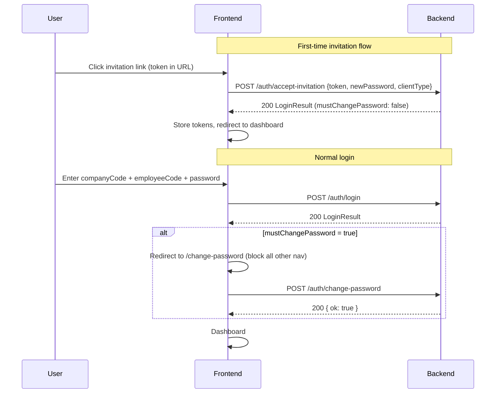
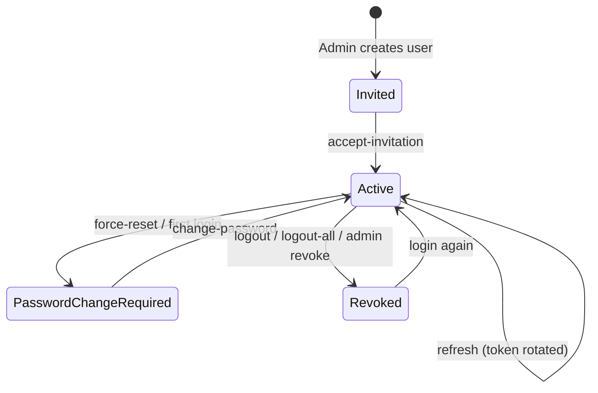

# Company Portal API — Authentication & Sessions

> **Family:** `company-portal-api.md`
> **Base URL:** `http://localhost:3000/api/v1`
> **Auth:** All routes below (except marked Public) require `Authorization: Bearer <accessToken>`
>
> See also: [company-portal-users.md](./company-portal-users.md) · [company-portal-rbac.md](./company-portal-rbac.md)

---

## Overview — Login Flow



---

## Auth Endpoints

### `POST /auth/login` — Public

Login with company code + employee code + password.

**Request Body**
```json
{
  "companyCode": "EDARA",
  "employeeCode": "EDA-001",
  "password": "MySecureP@ss1",
  "clientType": "web"
}
```

| Field | Type | Required | Notes |
|-------|------|----------|-------|
| `companyCode` | string | ✅ | 1–50 chars |
| `employeeCode` | string | ✅ | 1–50 chars |
| `password` | string | ✅ | 1–128 chars |
| `clientType` | `"web"` \| `"mobile"` | ✅ | |

**Response `200 OK`**
```json
{
  "accessToken": "eyJhbGciOiJIUzI1NiIsInR5cCI6IkpXVCJ9...",
  "refreshToken": "dGhpcyBpcyBhIHJlZnJlc2ggdG9rZW4...",
  "sessionId": "a1b2c3d4-e5f6-7890-abcd-ef1234567890",
  "expiresIn": 3600,
  "mustChangePassword": false
}
```

> ⚠️ If `mustChangePassword: true` — redirect to password change screen immediately. All other protected routes will return `403` until changed.

**Error Responses**
| Status | Condition |
|--------|-----------|
| `401` | Wrong credentials |
| `422` | After soft throttle threshold — returns generic "Invalid credentials" |
| `429` | Hard throttle — IP blocked |

---

### `POST /auth/refresh` — Public

Rotate tokens. Old refresh token is invalidated after use (rotation family detection — replay = all sessions revoked).

**Request Body**
```json
{ "refreshToken": "dGhpcyBpcyBhIHJlZnJlc2ggdG9rZW4..." }
```

**Response `200 OK`**
```json
{
  "accessToken": "eyJhbGciOiJIUzI1NiIsInR5cCI6IkpXVCJ9...",
  "refreshToken": "bmV3IHJlZnJlc2ggdG9rZW4gdmFsdWU=",
  "sessionId": "a1b2c3d4-e5f6-7890-abcd-ef1234567890",
  "expiresIn": 3600
}
```

**Error Responses**
| Status | Condition |
|--------|-----------|
| `401` | Invalid/expired/revoked refresh token |
| `409` | Replay detected — all family sessions revoked |

---

### `POST /auth/accept-invitation` — Public

First-time setup — converts invitation token to a full session.

**Request Body**
```json
{
  "token": "inv_abc123def456...",
  "newPassword": "NewSecureP@ss1",
  "clientType": "web"
}
```

| Field | Type | Required | Notes |
|-------|------|----------|-------|
| `token` | string | ✅ | From invitation email link |
| `newPassword` | string | ✅ | 8–128 chars |
| `clientType` | `"web"` \| `"mobile"` | ✅ | |

**Response `200 OK`** — Same as login `LoginResult`

**Error Responses**
| Status | Condition |
|--------|-----------|
| `422` | Token expired or invalid |
| `404` | User not found |

---

### `GET /auth/me` — Protected

Get the currently authenticated user's profile.

**Response `200 OK`**
```json
{
  "publicId": "550e8400-e29b-41d4-a716-446655440000",
  "employeeCode": "EDA-001",
  "firstName": "Ahmed",
  "lastName": "Al-Rashid",
  "email": "ahmed@edara.com",
  "status": "ACTIVE",
  "mustChangePassword": false,
  "companyCode": "EDARA"
}
```

---

### `POST /auth/change-password` — Protected

Change own password. The current session is preserved; all other sessions are revoked.

**Request Body**
```json
{
  "currentPassword": "OldP@ssword1",
  "newPassword": "NewSecureP@ss2"
}
```

| Field | Type | Required | Notes |
|-------|------|----------|-------|
| `currentPassword` | string | ✅ | 1–128 chars |
| `newPassword` | string | ✅ | 8–128 chars |

**Response `200 OK`**
```json
{ "ok": true }
```

**Error Responses**
| Status | Condition |
|--------|-----------|
| `422` | Current password is wrong |
| `401` | Not authenticated |

---

### `POST /auth/logout` — Protected

Revoke the current session only.

**Response `204 No Content`**

---

### `POST /auth/logout-all` — Protected

Revoke all sessions for the current user across all devices.

**Response `204 No Content`**

---

## Session Management

### `GET /auth/sessions` — Protected

List own active sessions (paginated).

**Query Parameters**
| Param | Type | Default | Notes |
|-------|------|---------|-------|
| `page` | integer | 1 | |
| `pageSize` | integer | 25 | max 100 |

**Response `200 OK`**
```json
{
  "items": [
    {
      "id": "a1b2c3d4-e5f6-7890-abcd-ef1234567890",
      "clientType": "web",
      "deviceName": "Chrome on Windows",
      "ipAddress": "185.100.10.25",
      "city": "Riyadh",
      "country": "SA",
      "latitude": 24.6748,
      "longitude": 46.6753,
      "createdAt": "2026-05-10T08:00:00.000Z",
      "lastUsedAt": "2026-05-16T11:45:00.000Z",
      "isCurrent": true
    }
  ],
  "meta": {
    "mode": "page",
    "page": 1,
    "pageSize": 25,
    "totalItems": 3,
    "totalPages": 1
  }
}
```

> `isCurrent: true` marks the session used to make this request — use this to highlight in the UI.

---

### `DELETE /auth/sessions/:sessionId` — Protected

Revoke one of your own sessions (e.g. "Sign out of this device").

**URL Params:** `sessionId` — UUID

**Response `204 No Content`**

**Error Responses**
| Status | Condition |
|--------|-----------|
| `403` | Session belongs to a different user |
| `404` | Session not found |

---

## Admin — Manage Other Users' Sessions

> These require the `sessions:read` / `sessions:revoke` permission.

### `GET /auth/users/:publicId/sessions` — Protected + `sessions:read`

List sessions for a specific user.

**URL Params:** `publicId` — target user's UUID

**Query Parameters** — same as own sessions

**Response `200 OK`** — Same `PaginatedResponse<SessionView>` shape as own sessions.

---

### `DELETE /auth/users/:publicId/sessions/:sessionId` — Protected + `sessions:revoke`

Force-revoke a specific session of another user.

**URL Params:**
- `publicId` — target user's UUID
- `sessionId` — session UUID to revoke

**Response `204 No Content`**

---

## Admin — Password Reset Flows

### `POST /auth/force-reset/:publicId` — Protected + `users:reset-password`

Force the user to change their password on next login. Does **not** send a new invitation email — just sets the `mustChangePassword` flag.

**URL Params:** `publicId` — target user's UUID

**Response `200 OK`**
```json
{ "ok": true }
```

---

### `POST /auth/reissue-invitation/:publicId` — Protected + `users:reset-password`

Reissue a new invitation email with a fresh token. Use this when the original invitation expired or was lost.

**URL Params:** `publicId` — target user's UUID

**Response `200 OK`**
```json
{ "ok": true }
```

**Error Responses**
| Status | Condition |
|--------|-----------|
| `404` | User not found or not in same company |
| `422` | User is not in an invitable state |

---

## Data Flow — Session Lifecycle


