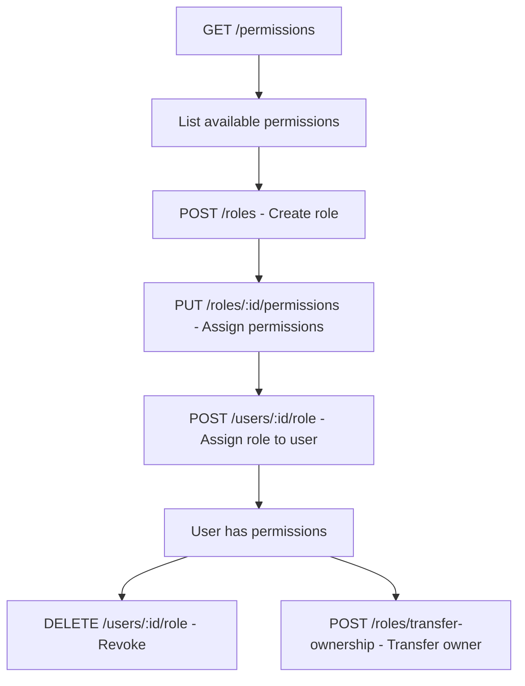
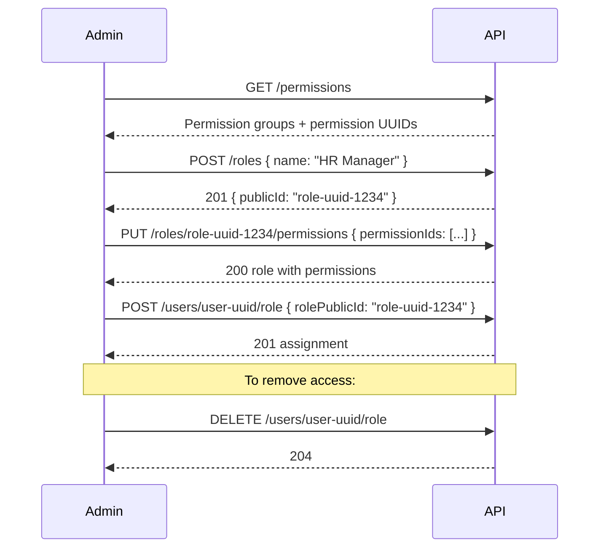

# Company Portal API — RBAC (Roles & Permissions)

> **Family:** `company-portal-api.md`
> **Base URL:** `http://localhost:3000/api/v1`
> **Auth:** All routes require `Authorization: Bearer <accessToken>`
>
> See also: [company-portal-api.md](./company-portal-api.md) · [company-portal-users.md](./company-portal-users.md)

---

## Overview

RBAC is company-scoped. Roles belong to a single company. The "Owner" role (`isOwner: true`) bypasses all permission checks — only one owner exists per company.



---

## Permissions

### `GET /permissions` — Protected + `roles:read`

List all permissions grouped by module. Use this to populate the permission picker when creating/editing roles.

**Response `200 OK`**
```json
[
  {
    "id": 1,
    "publicId": "pgrp-uuid-1",
    "name": "Users",
    "description": "User management permissions",
    "createdAt": "2024-01-01T00:00:00.000Z",
    "permissions": [
      {
        "id": 10,
        "publicId": "perm-uuid-10",
        "groupId": 1,
        "action": "users:create",
        "description": "Create new employees",
        "createdAt": "2024-01-01T00:00:00.000Z"
      },
      {
        "id": 11,
        "publicId": "perm-uuid-11",
        "groupId": 1,
        "action": "users:read",
        "description": "View employee list and details",
        "createdAt": "2024-01-01T00:00:00.000Z"
      }
    ]
  },
  {
    "id": 2,
    "publicId": "pgrp-uuid-2",
    "name": "Roles",
    "description": "Role management permissions",
    "createdAt": "2024-01-01T00:00:00.000Z",
    "permissions": [
      {
        "id": 20,
        "publicId": "perm-uuid-20",
        "groupId": 2,
        "action": "roles:create",
        "description": "Create roles",
        "createdAt": "2024-01-01T00:00:00.000Z"
      }
    ]
  }
]
```

> Store this list on app load and use `permission.publicId` when assigning permissions to roles.

---

## Roles

### `POST /roles` — Protected + `roles:create`

Create a new role for the current company.

**Request Body**
```json
{
  "name": "HR Manager",
  "description": "Manages employee records and HR processes"
}
```

| Field | Type | Required | Validation |
|-------|------|----------|-----------|
| `name` | string | ✅ | 1–100 chars |
| `description` | string | ❌ | max 500 chars |

**Response `201 Created`**
```json
{
  "publicId": "role-uuid-1234",
  "companyId": 5,
  "name": "HR Manager",
  "description": "Manages employee records and HR processes",
  "isOwner": false,
  "isSystem": false,
  "createdBy": 1,
  "createdAt": "2026-05-16T10:00:00.000Z",
  "updatedAt": "2026-05-16T10:00:00.000Z"
}
```

> `isOwner` and `isSystem` are always `false` for user-created roles.

**Error Responses**
| Status | Condition |
|--------|-----------|
| `409` | Role name already exists in this company |

---

### `GET /roles` — Protected + `roles:read`

List roles for the current company.

**Query Parameters**
| Param | Type | Notes |
|-------|------|-------|
| `search` | string | Filter by name |
| `page` | integer | Default 1 |
| `pageSize` | integer | Default 25, max 100 |

**Response `200 OK`**
```json
{
  "items": [
    {
      "publicId": "role-uuid-1234",
      "companyId": 5,
      "name": "HR Manager",
      "description": "Manages employee records",
      "isOwner": false,
      "isSystem": false,
      "createdBy": 1,
      "createdAt": "2026-05-16T10:00:00.000Z",
      "updatedAt": "2026-05-16T10:00:00.000Z"
    },
    {
      "publicId": "role-uuid-owner",
      "companyId": 5,
      "name": "Owner",
      "description": null,
      "isOwner": true,
      "isSystem": true,
      "createdBy": null,
      "createdAt": "2024-01-01T00:00:00.000Z",
      "updatedAt": "2024-01-01T00:00:00.000Z"
    }
  ],
  "meta": {
    "mode": "page",
    "page": 1,
    "pageSize": 25,
    "totalItems": 4,
    "totalPages": 1
  }
}
```

> Visually distinguish `isOwner: true` and `isSystem: true` roles in the UI — they cannot be deleted.

---

### `GET /roles/:publicId` — Protected + `roles:read`

Get a single role with its assigned permissions.

**URL Params:** `publicId` — UUID

**Response `200 OK`**
```json
{
  "publicId": "role-uuid-1234",
  "companyId": 5,
  "name": "HR Manager",
  "description": "Manages employee records",
  "isOwner": false,
  "isSystem": false,
  "createdBy": 1,
  "createdAt": "2026-05-16T10:00:00.000Z",
  "updatedAt": "2026-05-16T10:00:00.000Z",
  "permissions": [
    {
      "id": 10,
      "publicId": "perm-uuid-10",
      "groupId": 1,
      "action": "users:create",
      "description": "Create new employees",
      "createdAt": "2024-01-01T00:00:00.000Z"
    }
  ]
}
```

**Error Responses**
| Status | Condition |
|--------|-----------|
| `404` | Role not found or belongs to another company |

---

### `PUT /roles/:publicId` — Protected + `roles:update`

Update role name or description (full replace of mutable fields).

**URL Params:** `publicId` — UUID

**Request Body**
```json
{
  "name": "Senior HR Manager",
  "description": "Updated description"
}
```

| Field | Type | Required | Validation |
|-------|------|----------|-----------|
| `name` | string | ❌ | 1–100 chars |
| `description` | string \| null | ❌ | max 500 chars |

**Response `200 OK`** — updated role object (same shape as single get)

**Error Responses**
| Status | Condition |
|--------|-----------|
| `403` | Cannot update system or owner roles |
| `404` | Role not found |
| `409` | Name already taken |

---

### `DELETE /roles/:publicId` — Protected + `roles:delete`

Delete a role. Fails if the role is a system role or has active user assignments.

**URL Params:** `publicId` — UUID

**Response `204 No Content`**

**Error Responses**
| Status | Condition |
|--------|-----------|
| `403` | Cannot delete system/owner roles |
| `422` | Role is currently assigned to one or more users |

---

### `PUT /roles/:publicId/permissions` — Protected + `roles:update`

Replace the full set of permissions for a role (full overwrite, not append). To clear all permissions, send an empty array.

**URL Params:** `publicId` — UUID

**Request Body**
```json
{
  "permissionIds": [
    "perm-uuid-10",
    "perm-uuid-11",
    "perm-uuid-20"
  ]
}
```

> Use `publicId` values from `GET /permissions` — these are UUIDs, not numeric IDs.

**Response `200 OK`** — updated role with permissions

**Error Responses**
| Status | Condition |
|--------|-----------|
| `404` | One or more permission UUIDs not found |
| `403` | Cannot modify owner role permissions |

---

## User Role Assignments

Each user can have **at most one active role** at a time. Assigning a new role replaces the previous assignment.

### `POST /users/:publicId/role` — Protected + `roles:assign`

Assign a role to a user. Optionally set an expiry date.

**URL Params:** `publicId` — target user's UUID

**Request Body**
```json
{
  "rolePublicId": "role-uuid-1234",
  "expiresAt": "2027-01-01T00:00:00.000Z"
}
```

| Field | Type | Required | Notes |
|-------|------|----------|-------|
| `rolePublicId` | string (UUID) | ✅ | Must belong to the same company |
| `expiresAt` | ISO datetime \| omit | ❌ | Null = never expires |

**Response `201 Created`**
```json
{
  "publicId": "assignment-uuid",
  "userId": 14,
  "roleId": 3,
  "assignedBy": 1,
  "assignedAt": "2026-05-16T10:00:00.000Z",
  "expiresAt": "2027-01-01T00:00:00.000Z",
  "isActive": true,
  "revokedBy": null,
  "revokedAt": null,
  "role": {
    "publicId": "role-uuid-1234",
    "name": "HR Manager",
    "isOwner": false,
    "isSystem": false
  }
}
```

**Error Responses**
| Status | Condition |
|--------|-----------|
| `404` | User or role not found |
| `403` | Role belongs to a different company |

---

### `GET /users/:publicId/role` — Protected + `users:read`

Get the currently active role assignment for a user.

**URL Params:** `publicId` — target user's UUID

**Response `200 OK`** — same shape as assignment above, or `null` if no role assigned.

---

### `DELETE /users/:publicId/role` — Protected + `roles:assign`

Revoke the current role from a user.

**URL Params:** `publicId` — target user's UUID

**Response `204 No Content`**

**Error Responses**
| Status | Condition |
|--------|-----------|
| `404` | User not found or has no active role |
| `403` | Cannot revoke owner role via this endpoint |

---

## Ownership Transfer

### `POST /roles/transfer-ownership` — Protected + `roles:assign`

Transfer the owner role from the current user to another user in the same company. **Irreversible without another transfer.** Only the current owner can do this.

**Request Body**
```json
{
  "toUserPublicId": "target-user-uuid"
}
```

**Response `200 OK`**
```json
{ "message": "Ownership transferred successfully" }
```

**Error Responses**
| Status | Condition |
|--------|-----------|
| `403` | Caller is not the current owner |
| `404` | Target user not found in this company |
| `422` | Target user already is the owner |

---

## Data Flow — Role Management



---

## UI Implementation Notes

1. **Permission picker** — call `GET /permissions` once on app load; group checkboxes by `group.name`.
2. **Disable delete** for `isOwner: true` or `isSystem: true` roles.
3. **Role expiry** — show a warning badge when `expiresAt` is within 7 days.
4. **Owner highlight** — clearly distinguish the owner role in the UI (it bypasses all permission checks).
5. **Ownership transfer** — put this behind a confirmation dialog with serious warnings; it cannot be undone without the new owner's cooperation.
