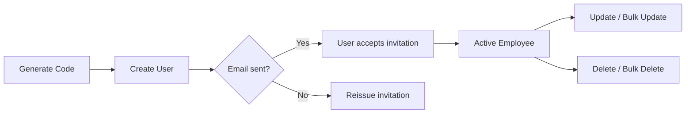
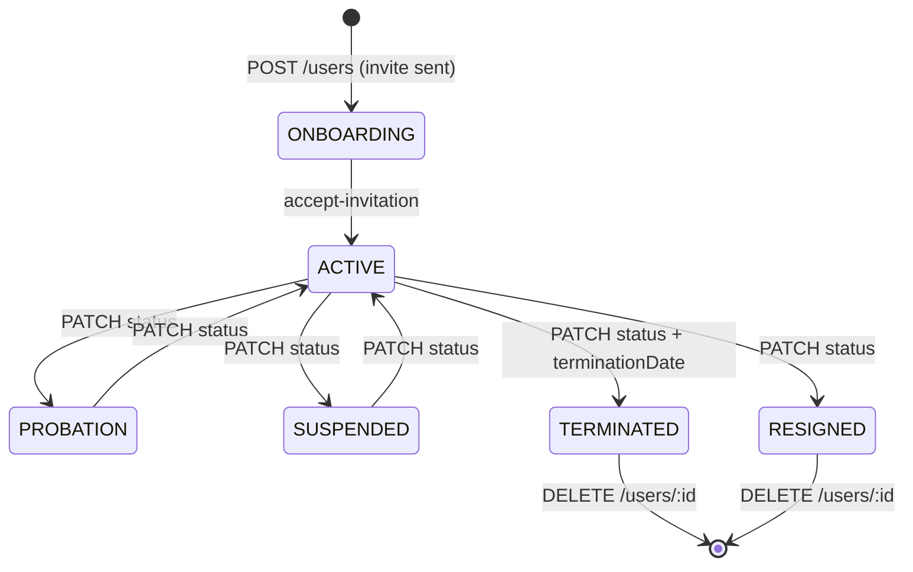

# Company Portal API — Users

> **Family:** `company-portal-api.md`
> **Base URL:** `http://localhost:3000/api/v1`
> **Auth:** All routes require `Authorization: Bearer <accessToken>`
>
> See also: [company-portal-api.md](./company-portal-api.md) · [company-portal-rbac.md](./company-portal-rbac.md)

---

## Overview

Users are scoped to the authenticated user's company — `companyId` is **never** sent in the body; it's derived from the JWT identity on the server.



---

## Single User CRUD

### `GET /users/generate-code` — Protected

Pre-generate the next available employee code for the current company. Call this before the create form to pre-fill the code field.

**Response `200 OK`**
```json
{ "employeeCode": "EDA-004" }
```

---

### `POST /users` — Protected

Create a single employee. An invitation email is dispatched automatically.

**Request Body**
```json
{
  "firstName": "Sara",
  "lastName": "Al-Otaibi",
  "email": "sara@edara.com",
  "phone": "+966501112233",
  "status": "ONBOARDING",
  "employmentType": "FULL_TIME",
  "workLocation": "HYBRID",
  "hireDate": "2026-06-01",
  "departmentId": 3,
  "jobId": 7,
  "managerId": 2,
  "hrId": null,
  "branchId": null,
  "shiftId": null,
  "level": "Mid",
  "dateOfBirth": "1995-08-14",
  "maritalStatus": "SINGLE",
  "gender": "FEMALE",
  "nationality": "Saudi",
  "nationalId": "2012345678",
  "photoUrl": null,
  "bankAccount": null
}
```

| Field | Type | Required | Validation |
|-------|------|----------|-----------|
| `firstName` | string | ✅ | 1–120 chars |
| `lastName` | string | ✅ | 1–120 chars |
| `email` | string (email) | ✅ | max 255 chars |
| `phone` | string | ❌ | max 50 chars |
| `status` | `UserStatus` | ❌ | enum (see guide) |
| `employmentType` | `EmploymentType` | ❌ | enum |
| `workLocation` | `WorkLocationType` | ❌ | enum |
| `hireDate` | date string (`YYYY-MM-DD`) | ❌ | |
| `terminationDate` | date string \| null | ❌ | |
| `departmentId` | integer \| null | ❌ | internal DB id |
| `jobId` | integer \| null | ❌ | internal DB id |
| `managerId` | integer \| null | ❌ | internal DB id |
| `hrId` | integer \| null | ❌ | internal DB id |
| `branchId` | integer \| null | ❌ | internal DB id |
| `shiftId` | integer \| null | ❌ | internal DB id |
| `level` | string | ❌ | max 80 chars |
| `dateOfBirth` | date string | ❌ | |
| `gender` | string | ❌ | max 40 chars |
| `nationality` | string | ❌ | max 80 chars |
| `nationalId` | string | ❌ | max 80 chars |
| `bankAccount` | string | ❌ | max 120 chars |
| `photoUrl` | string | ❌ | max 500 chars |

**Response `201 Created`**
```json
{
  "publicId": "550e8400-e29b-41d4-a716-446655440000",
  "employeeCode": "EDA-004",
  "firstName": "Sara",
  "lastName": "Al-Otaibi",
  "email": "sara@edara.com",
  "phone": "+966501112233",
  "status": "ONBOARDING",
  "branchId": null,
  "departmentId": 3,
  "jobId": 7,
  "managerId": 2,
  "hrId": null,
  "shiftId": null,
  "employmentType": "FULL_TIME",
  "workLocation": "HYBRID",
  "hireDate": "2026-06-01",
  "terminationDate": null,
  "level": "Mid",
  "dateOfBirth": "1995-08-14",
  "maritalStatus": "SINGLE",
  "gender": "FEMALE",
  "nationality": "Saudi",
  "nationalId": "2012345678",
  "photoUrl": null,
  "bankAccount": null,
  "lastLoginAt": null,
  "mustChangePassword": true,
  "createdBy": 1,
  "createdAt": "2026-05-16T10:00:00.000Z",
  "updatedAt": "2026-05-16T10:00:00.000Z",
  "deletedAt": null
}
```

**Error Responses**
| Status | Condition |
|--------|-----------|
| `409` | Email already exists in the company |
| `422` | Domain validation failed (e.g. invalid status transition) |

---

### `GET /users` — Protected

List employees with filters and pagination.

**Query Parameters**
| Param | Type | Notes |
|-------|------|-------|
| `status` | `UserStatus` | Filter by status |
| `employmentType` | `EmploymentType` | Filter by type |
| `workLocation` | `WorkLocationType` | Filter by location |
| `departmentId` | integer | Filter by department |
| `branchId` | integer | Filter by branch |
| `jobId` | integer | Filter by job |
| `managerId` | integer | Filter by manager |
| `search` | string | Full-text search (name, email, code) |
| `page` | integer | Default 1 |
| `pageSize` | integer | Default 25, max 100 |
| `sort` | string | `createdAtAsc` `createdAtDesc` `nameAsc` `nameDesc` |

**Response `200 OK`**
```json
{
  "items": [
    {
      "publicId": "550e8400-e29b-41d4-a716-446655440000",
      "employeeCode": "EDA-001",
      "firstName": "Ahmed",
      "lastName": "Al-Rashid",
      "email": "ahmed@edara.com",
      "phone": "+966501234567",
      "status": "ACTIVE",
      "departmentId": 3,
      "jobId": 7,
      "managerId": null,
      "hrId": null,
      "branchId": null,
      "shiftId": null,
      "employmentType": "FULL_TIME",
      "workLocation": "ONSITE",
      "hireDate": "2024-01-15",
      "terminationDate": null,
      "level": "Senior",
      "dateOfBirth": "1990-03-22",
      "maritalStatus": "MARRIED",
      "gender": "MALE",
      "nationality": "Saudi",
      "nationalId": "1099887766",
      "photoUrl": null,
      "bankAccount": null,
      "lastLoginAt": "2026-05-16T09:30:00.000Z",
      "mustChangePassword": false,
      "createdBy": 1,
      "createdAt": "2024-01-15T08:00:00.000Z",
      "updatedAt": "2026-05-16T09:30:00.000Z",
      "deletedAt": null
    }
  ],
  "meta": {
    "mode": "page",
    "page": 1,
    "pageSize": 25,
    "totalItems": 42,
    "totalPages": 2
  }
}
```

---

### `GET /users/:publicId` — Protected

Get a single employee's full profile.

**URL Params:** `publicId` — UUID

**Response `200 OK`** — same shape as a single item in the list response above.

**Error Responses**
| Status | Condition |
|--------|-----------|
| `404` | User not found in this company |

---

### `PATCH /users/:publicId` — Protected

Partial update of an employee. All fields are optional.

**URL Params:** `publicId` — UUID

**Request Body** (send only changed fields)
```json
{
  "status": "ACTIVE",
  "workLocation": "REMOTE",
  "departmentId": 5,
  "level": "Lead"
}
```

> `employeeCode` can be set to `null` to clear it.

**Response `200 OK`** — full updated user object (same shape as create response)

**Error Responses**
| Status | Condition |
|--------|-----------|
| `404` | User not found |
| `409` | Email already used by another employee |
| `422` | Invalid field value |

---

### `DELETE /users/:publicId` — Protected

Soft-delete an employee (sets `deletedAt`).

**URL Params:** `publicId` — UUID

**Response `204 No Content`**

---

## Bulk Operations

All bulk endpoints process records individually — **partial success is allowed**. Always check `errors[]`.

### `POST /users/bulk` — Protected

Create up to 100 employees in a single request.

**Request Body** — Array of create objects (same fields as single create)
```json
[
  {
    "firstName": "Khalid",
    "lastName": "Al-Zahrani",
    "email": "khalid@edara.com",
    "employmentType": "FULL_TIME",
    "hireDate": "2026-06-01"
  },
  {
    "firstName": "Nora",
    "lastName": "Al-Ghamdi",
    "email": "nora@edara.com",
    "employmentType": "PART_TIME"
  }
]
```

| Constraint | Value |
|-----------|-------|
| Min items | 1 |
| Max items | 100 |
| Required per item | `firstName`, `lastName`, `email` |

**Response `201 Created`**
```json
{
  "success": [
    {
      "publicId": "aabb1122-...",
      "employeeCode": "EDA-005",
      "firstName": "Khalid",
      ...
    }
  ],
  "errors": [
    {
      "index": 1,
      "error": "Email already exists"
    }
  ]
}
```

> `index` is the 0-based position in the input array.

---

### `PATCH /users/bulk` — Protected

Update up to 100 employees. Each item must include `publicId`.

**Request Body**
```json
[
  {
    "publicId": "550e8400-e29b-41d4-a716-446655440000",
    "status": "SUSPENDED",
    "workLocation": "REMOTE"
  },
  {
    "publicId": "aabb1122-ccdd-3344-eeff-556677889900",
    "departmentId": 4,
    "level": "Senior"
  }
]
```

**Response `200 OK`**
```json
{
  "success": [ { "publicId": "550e8400-...", ...updatedUser } ],
  "errors": []
}
```

---

### `DELETE /users/bulk` — Protected

Soft-delete up to 100 employees by their `publicId` list.

**Request Body**
```json
{
  "publicIds": [
    "550e8400-e29b-41d4-a716-446655440000",
    "aabb1122-ccdd-3344-eeff-556677889900"
  ]
}
```

| Constraint | Value |
|-----------|-------|
| Min items | 1 |
| Max items | 100 |

**Response `200 OK`**
```json
{
  "deleted": 2,
  "errors": []
}
```

---

## Data Flow — Employee Lifecycle



---

## Tips for UI Implementation

1. **Pre-fill employee code** — call `GET /users/generate-code` when the create form opens, not on submit.
2. **Bulk import from CSV** — map CSV rows to the bulk create array; display the `errors[]` per row with the original `index`.
3. **Search debounce** — the `search` param does full-text match; debounce at 300ms.
4. **Soft-deleted users** — deleted users have `deletedAt != null`; the API filters them out by default — they won't appear in list results.
5. **Manager/HR dropdowns** — populate these from `GET /users?status=ACTIVE`; use `publicId` for display but be aware the schema expects the internal numeric `managerId` — you need to resolve this via your own cache/lookup since the API returns numeric IDs for relations.
